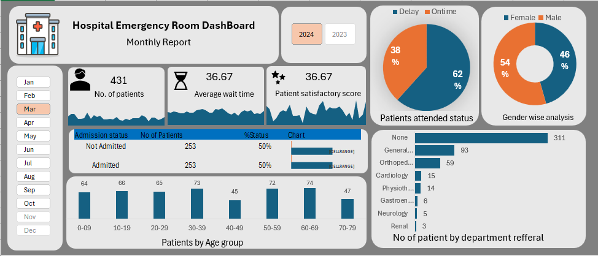
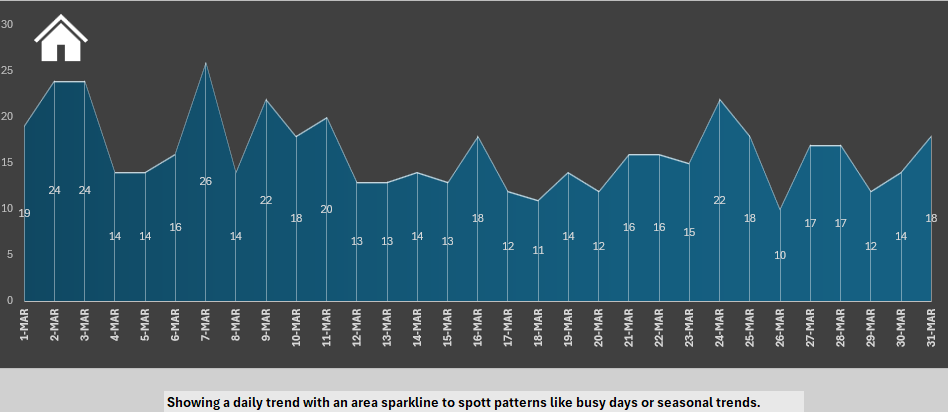
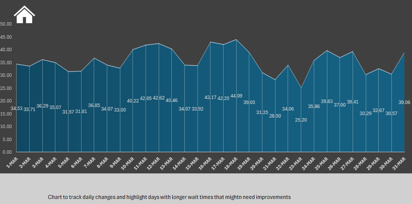
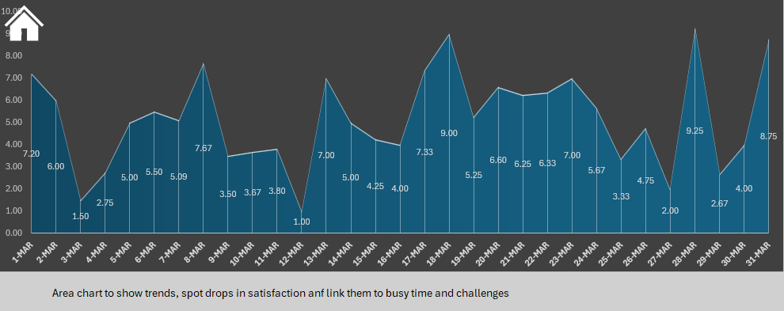

# Hospital Emergency Room Dashboard (Excel)

## Project Overview
Developed an interactive Excel dashboard to monitor hospital emergency room performance. The dashboard tracks key KPIs including total patients, average wait time, and patient satisfaction score, with drill-down navigation to detailed daily trend analysis. It also visualizes patient distribution by age group, gender, and department referrals, helping identify peak demand periods and operational insights for improved hospital management.

## Tools Used
- Microsoft Excel
- Pivot Tables & Charts
- Slicers
- Interactive Dashboard Design

## Dashboard Features
- Interactive KPI cards for quick overview of ER performance
- Clickable charts to navigate to detailed trend analysis
- Daily ER patient trend visualization
- Average waiting time trend analysis
- Patient satisfaction score monitoring

## Screenshots

**Main Dashboard**  

**Daily ER Patient Trend**  

**Average Waiting Time Trend**  

**Patient Satisfaction Score Trend**  

## Files in Repository
- `Hospital_Data.csv` – Raw data
- `hospital_emergency_room_dashboard.xlsx` – Excel dashboard
- `hospital_emergency_room_analysis.pdf` – Summary & recommendations
- `Screenshots/` – Dashboard screenshots

## Key Insights
- Total ER patients for the selected period were 431, showing peak periods during afternoons.  
- Average waiting time was approximately 36 minutes, indicating moderate patient flow pressure.  
- Patient satisfaction score averaged 36.67, highlighting potential areas for operational improvement.  
